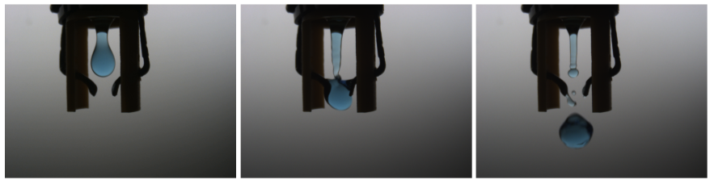
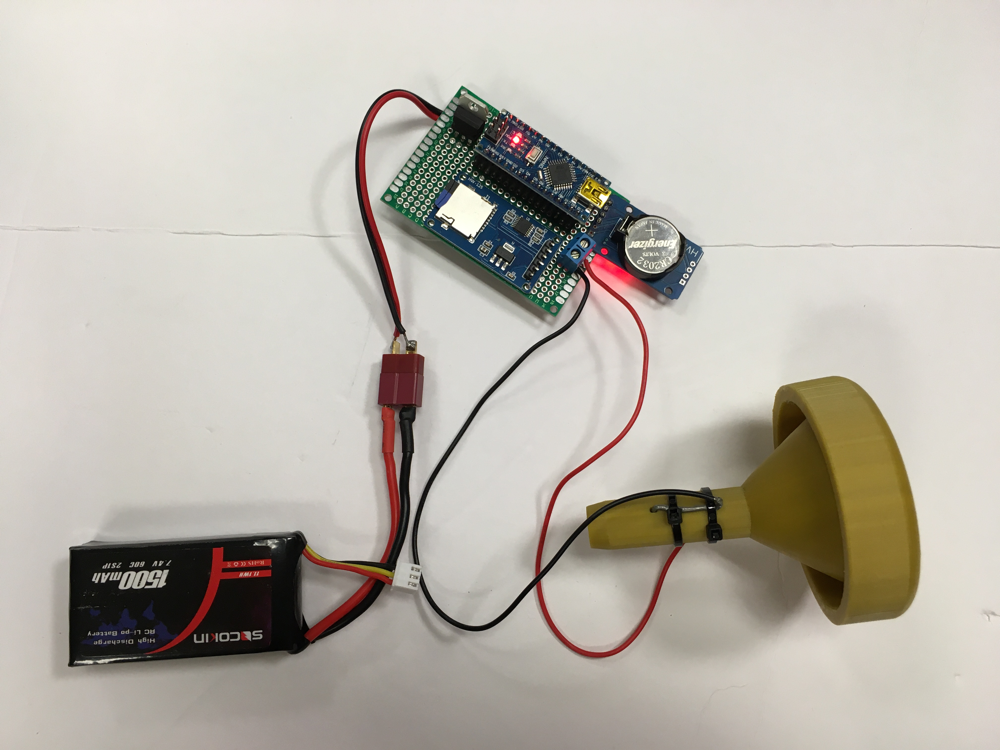

# Rain-Gauge-Sensor-Package
Measuring the rain

Figure 1: Drone delivering a sensor package underneath a structure.

Figure 1: Drone delivering a sensor package underneath a structure.

Figure 1: Drone delivering a sensor package underneath a structure.

